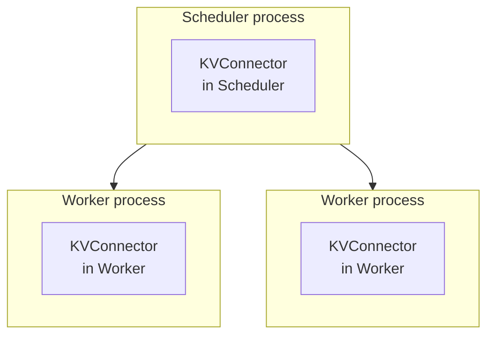
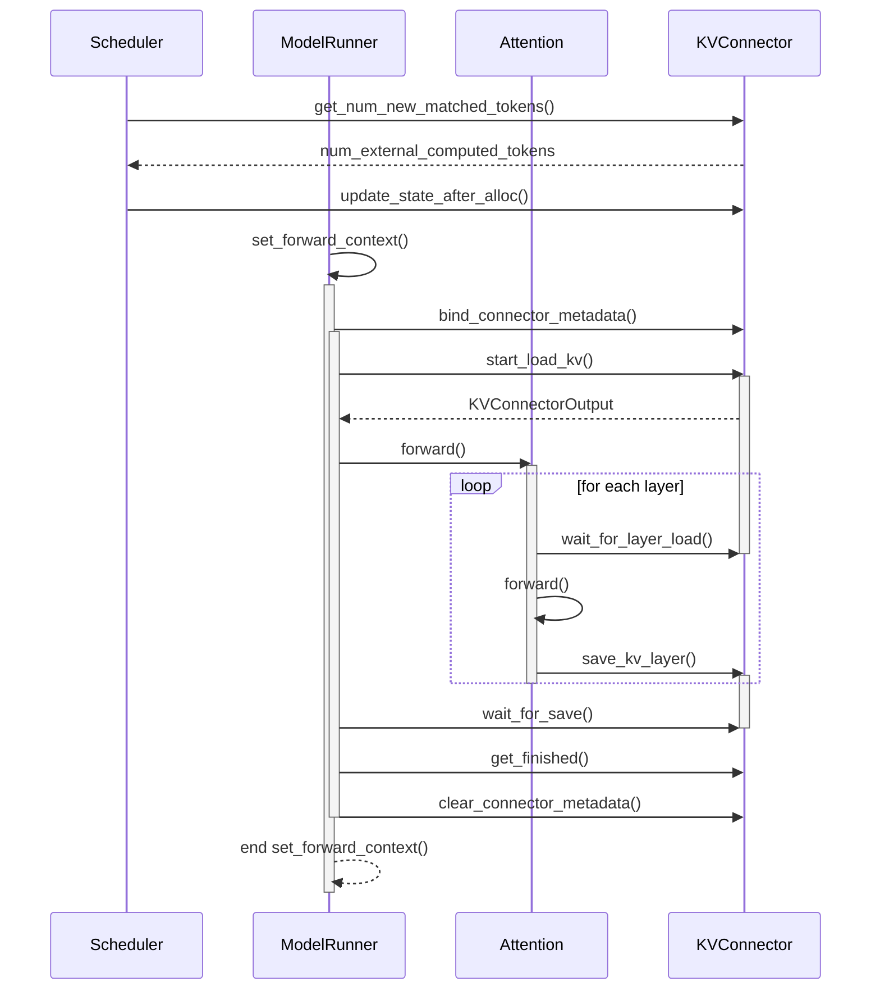
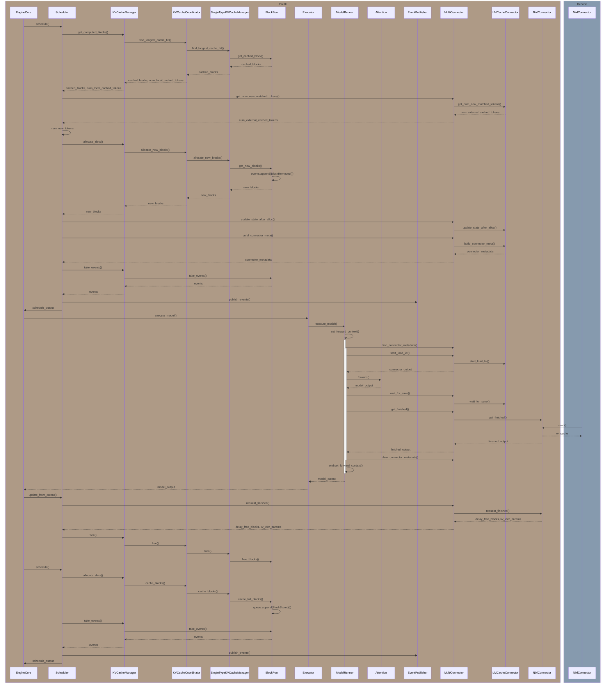

## vLLM 설정

- 환경 변수
  - `PYTHONHASHSEED=<int>`
    - 첫 번째 요청의 부모 hash 값을 만들 때 사용됩니다.
    - 설정하지 않으면 랜덤 값이 설정되어 cache hit를 계산할 수 없습니다.
- Scheduler
  - `--enable-chunked-prefill`
- Cache
  - `--enable-prefix-caching`
  - `--block-size <size>`
    - 1, 8, 16, 32, 64, 128 중에 선택할 수 있습니다.
  - `--prefix-caching-hash-algo builtin`
    - hash 알고리즘을 지정합니다.
    - `builtin`: python `hash` 함수를 사용합니다.
    - `sha256`
    - `sha256_cbor_64bit`
- vLLM
  - `--kv-events-config <configJson>`
    - `enable_kv_cache_events: true`
    - `publisher: zmq`
    - `endpoint: tcp://<host>:<port>`
    - `topic: <topic>`
  - `--kv-transfer-config '{"<option>": "<value>", ...}'`
    - `<option>`
      - `kv_connector: <KVConnectorBaseV1Impl>`
        - KVConnector 구현체를 지정합니다.
        - e.g. `NixlConnector`, `MultiConnector`
      - `kv_role: <role>`
        - `kv_producer`, `kv_consumer`, `kv_both` 중 하나를 지정합니다.
      - `kv_connector_module_path: <module>`
        - vllm에 포함되지 않은 KVConnector 구현체를 사용할 경우, 해당 모듈의 경로를 지정합니다.
        - e.g. `lmcache.integration.vllm.lmcache_connector_v1`

## KVConnectorBase_V1

:::info[Reference]

- [vLLM GitHub / PR #15960](https://github.com/vllm-project/vllm/pull/15960)

:::

하나의 vLLM은 아래와 같이 구성되어 있습니다.

### Worker

- `start_load_kv()`
  - 불러올 KVCache가 있는 경우 KVCache를 불러오기 시작합니다.
  - 두 가지 구현방식이 있습니다.
    - 한 번에 모든 layer의 KVCache를 불러오기
    - 비동기적으로 불러오면서 `wait_for_layer_load()`를 통해 각 layer가 실행되기 전에 완료될 때까지 대기
- `wait_for_layer_load()`
  - 해당 layer의 KVCache가 불러와졌는지 확인합니다.
  - `start_load_kv()`에서 모든 layer의 KVCache를 불러오는 구현인 경우, 구현하지 않아도 됩니다.
- `save_kv_layer()`
  - 해당 layer의 KVCache를 저장합니다.
  - 오프로딩하지 않거나 `wait_for_save()`에서 한 번에 모든 layer를 저장하는 구현인 경우, 구현하지 않아도 됩니다.
- `wait_for_save()`
  - 모든 layer의 KVCache가 저장될 때까지 대기합니다.
  - 오프로딩하지 않는 경우, 구현하지 않아도 됩니다.
  - 구현하는 경우 두 가지 구현방식이 있습니다.
    - `save_kv_layer()` 호출 시 비동기적으로 저장하기 시작하고 모든 layer가 저장될 때까지 대기
    - 한 번에 모든 layer의 KVCache를 저장하기

## Prefill

:::warning

호출하지만 KVCache 흐름에 영향을 미치지 않는 함수들은 표시하지 않았습니다. 필요 없는 부분을 생략하는 과정에서 순서 파악이 잘못되었을 수 있습니다.

:::

가정은 아래와 같습니다.

- LMCacheConnector를 사용합니다.
- NixlConnector를 사용합니다.
- prefix cache를 사용합니다.

- `update_state_after_alloc()`: request, blocks(`cached_blocks + new_blocks`), num_external_cached_tokens이 KVConnector에 전달됩니다.
- `num_new_tokens`: `num_input_tokens - num_local_cached_tokens - num_external_cached_tokens`
- `free_blocks()`: block.ref_cnt가 0인 경우 free_block_queue에 추가합니다.
