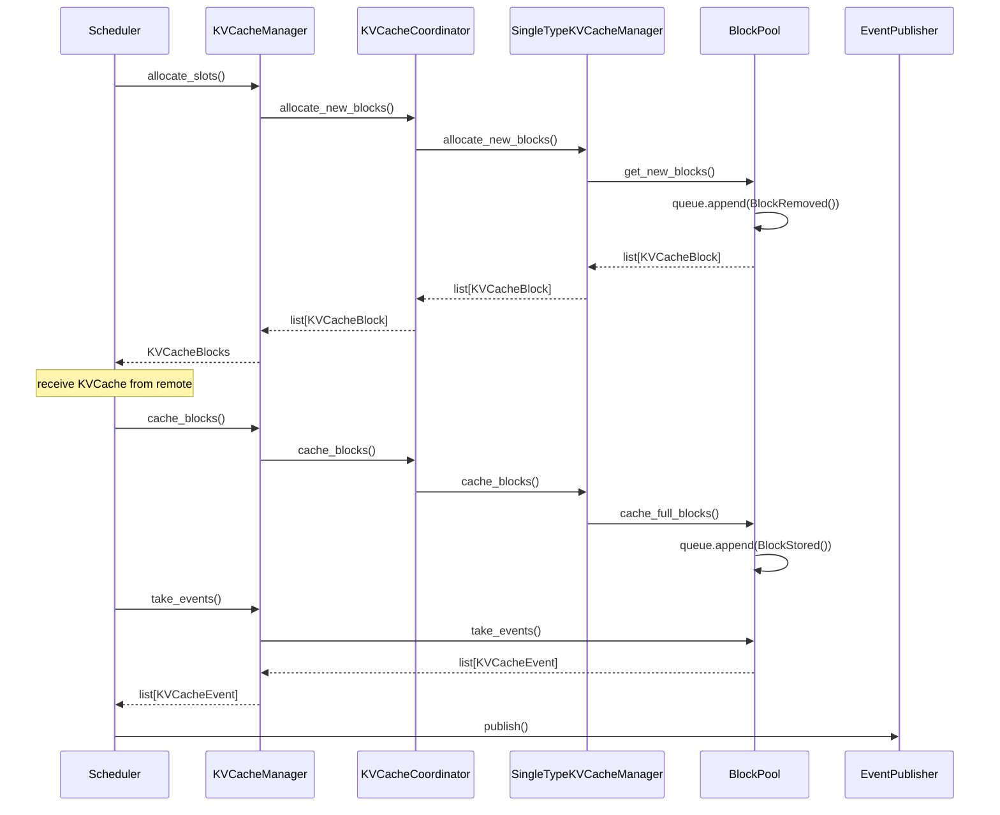

```mermaid
sequenceDiagram
  Scheduler ->> KVCacheManager: allocate_slots()
  KVCacheManager ->> KVCacheCoordinator: allocate_new_blocks()
  KVCacheCoordinator ->> SingleTypeKVCacheManager: allocate_new_blocks()
  SingleTypeKVCacheManager ->> BlockPool: get_new_blocks()
  BlockPool ->> BlockPool: queue.append(BlockRemoved())
  BlockPool -->> SingleTypeKVCacheManager: list[KVCacheBlock]
  SingleTypeKVCacheManager -->> KVCacheCoordinator: list[KVCacheBlock]
  KVCacheCoordinator -->> KVCacheManager: list[KVCacheBlock]
  KVCacheManager -->> Scheduler: KVCacheBlocks

  Note over Scheduler: receive KVCache from remote

  Scheduler ->> KVCacheManager: cache_blocks()
  KVCacheManager ->> KVCacheCoordinator: cache_blocks()
  KVCacheCoordinator ->> SingleTypeKVCacheManager: cache_blocks()
  SingleTypeKVCacheManager ->> BlockPool: cache_full_blocks()
  BlockPool ->> BlockPool: queue.append(BlockStored())

  Scheduler ->> KVCacheManager: take_events()
  KVCacheManager ->> BlockPool: take_events()
  BlockPool -->> KVCacheManager: list[KVCacheEvent]
  KVCacheManager -->> Scheduler: list[KVCacheEvent]
  Scheduler ->> EventPublisher: publish()
```
