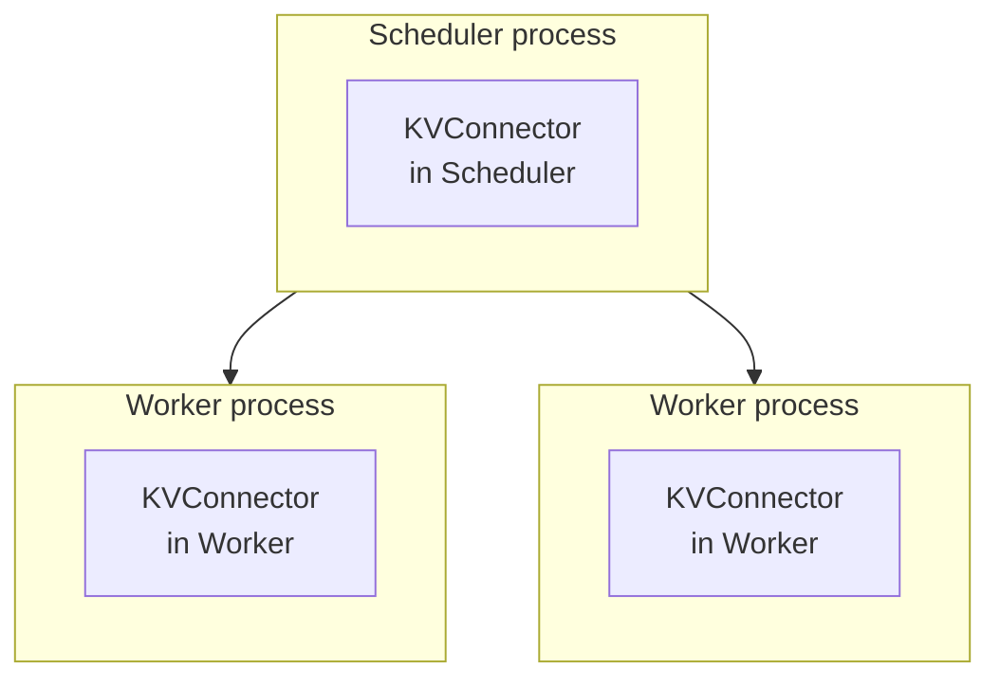
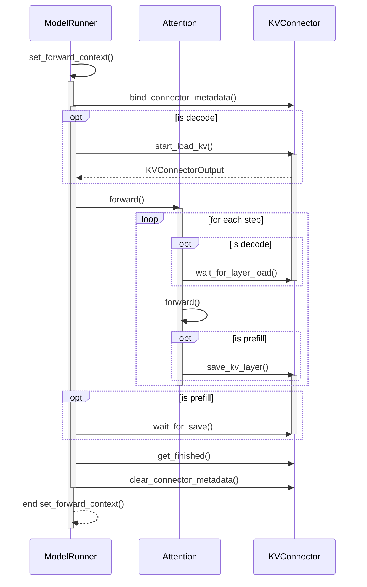

## KVConnectorBase_V1

:::info[Reference]

- [vLLM GitHub / PR #15960](https://github.com/vllm-project/vllm/pull/15960)

:::

하나의 vLLM은 아래와 같이 구성되어 있습니다.

### Worker

- `start_load_kv()`
  - 불러올 KVCache가 있는 경우 KVCache를 불러오기 시작합니다.
  - 두 가지 구현방식이 있습니다.
    - 한 번에 모든 layer의 KVCache를 불러오기
    - 비동기적으로 불러오면서 `wait_for_layer_load()`를 통해 각 layer가 실행되기 전에 완료될 때까지 대기
- `wait_for_layer_load()`
  - 해당 layer의 KVCache가 불러와졌는지 확인합니다.
  - `start_load_kv()`에서 모든 layer의 KVCache를 불러오는 구현인 경우, 구현하지 않아도 됩니다.
- `save_kv_layer()`
  - 해당 layer의 KVCache를 저장합니다.
  - 오프로딩하지 않거나 `wait_for_save()`에서 한 번에 모든 layer를 저장하는 구현인 경우, 구현하지 않아도 됩니다.
- `wait_for_save()`
  - 모든 layer의 KVCache가 저장될 때까지 대기합니다.
  - 오프로딩하지 않는 경우, 구현하지 않아도 됩니다.
  - 구현하는 경우 두 가지 구현방식이 있습니다.
    - `save_kv_layer()` 호출 시 비동기적으로 저장하기 시작하고 모든 layer가 저장될 때까지 대기
    - 한 번에 모든 layer의 KVCache를 저장하기
