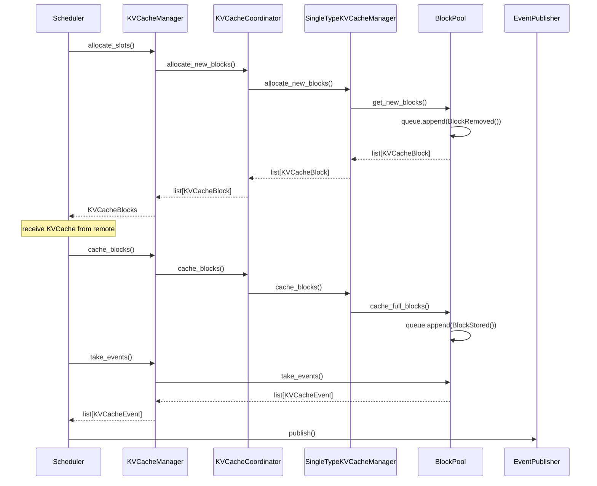

## 설정

- 환경 변수
  - `PYTHONHASHSEED=<int>`
    - 첫 번째 요청의 부모 hash 값을 만들 때 사용됩니다.
    - 설정하지 않으면 랜덤 값이 설정되어 cache hit를 계산할 수 없습니다.
- Scheduler
  - `--enable-chunked-prefill`
- Cache
  - `--enable-prefix-caching`
  - `--block-size <size>`
    - 1, 8, 16, 32, 64, 128 중에 선택할 수 있습니다.
  - `--prefix-caching-hash-algo builtin`
    - hash 알고리즘을 지정합니다.
    - `builtin`: python `hash` 함수를 사용합니다.
    - `sha256`
    - `sha256_cbor_64bit`
- vLLM
  - `--kv-events-config <configJson>`
    - `enable_kv_cache_events: true`
    - `publisher: zmq`
    - `endpoint: tcp://<host>:<port>`
    - `topic: <topic>`

## KVCacheEvent

