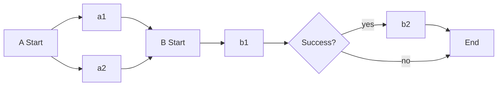

## `dag`

`dag`는 연속적인 template 실행 순서를 정의할 수 있는 방법 중 하나입니다. 의존성이 없는 작업은 바로 실행됩니다.

- https://argoproj.github.io/argo-workflows/fields/#dagtemplate

```yaml
spec:
  entrypoint: dag-test
  templates:
    - name: dag-test
      dag:
        tasks:
          - name: a1
            inline:
              {}
              # <template>을 직접 선언할 수 있습니다.
          - name: a2
            template: work2
          - name: b1
            depends: "a1 && a2"
            template: work3
          - name: b2
            depends: b1
            template: work4
            when: "{{tasks.b1.outputs.result}} == success"
```

<center>



</center>

- `tasks`
  - `depends`
    - https://argoproj.github.io/argo-workflows/enhanced-depends-logic/
    - dag 내에서 dependencies와 함께 사용할 수 없습니다.

### Variables

- https://argoproj.github.io/argo-workflows/variables/#dag-templates

## `steps`

`steps`는 연속적인 template 실행 순서를 정의할 수 있는 방법 중 하나입니다. 리스트 안의 리스트로 구성됩니다.

- https://argoproj.github.io/argo-workflows/fields/#workflowstep

```yaml
spec:
  entrypoint: steps-test
  templates:
    - name: steps-test
      steps:
        - - name: a1
            inline:
              {}
              # <template>을 직접 선언할 수 있습니다.
          - name: a2
            template: work2
        - - name: b1
            template: work3
          - name: b2
            template: work4
            when: "{{steps.b1.outputs.result}} == success"
```

위와 같이 정의한 경우 아래와 같은 순서로 진행됩니다. `a1`, `a2`는 병렬로 실행되고, `b2`는 `b1`의 결과에 따라 실행됩니다.

<center>


</center>
