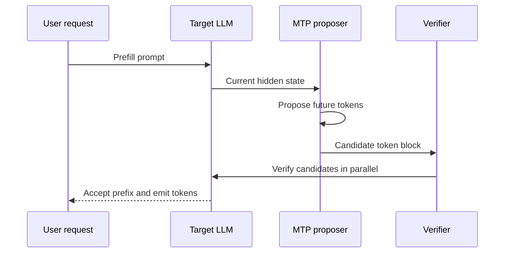

## Multi-Token Prediction

:::info[References]

- [Better & Faster Large Language Models via Multi-token Prediction](https://proceedings.mlr.press/v235/gloeckle24a.html)
- [DeepSeek-V3 Technical Report](https://arxiv.org/abs/2412.19437)
- [Medusa: Simple LLM Inference Acceleration Framework with Multiple Decoding Heads](https://arxiv.org/abs/2401.10774)
- [vLLM / MTP (Multi-Token Prediction)](https://docs.vllm.ai/en/latest/features/speculative_decoding/mtp/)
- [SGLang / DeepSeek V3 / Multi-token Prediction](https://github.com/sgl-project/sglang/blob/main/docs/basic_usage/deepseek_v3.md#multi-token-prediction)
- [Self-Distillation for Multi-Token Prediction](https://arxiv.org/abs/2603.23911)

:::

Multi-Token Prediction (MTP) trains an LLM to predict more than one future token from the same context. Standard next-token prediction optimizes only `x[t + 1]` at position `t`. MTP adds auxiliary prediction targets such as `x[t + 2]`, `x[t + 3]`, and `x[t + 4]`.

The main goals are:

- denser supervision during pre-training;
- better representations for future-token planning;
- native proposal tokens for speculative decoding at inference time.

## Basic Idea

```mermaid
flowchart LR
  A[Shared transformer trunk] --> B[Main next-token head]
  A --> C[MTP head or module 1]
  A --> D[MTP head or module 2]
  A --> E[MTP head or module k]
  B --> F[x[t + 1]]
  C --> G[x[t + 2]]
  D --> H[x[t + 3]]
  E --> I[x[t + k + 1]]
```

The Gloeckle et al. ICML 2024 design uses `n` independent output heads on top of a shared model trunk. At every corpus position, the model predicts the next `n` tokens. The authors report improved sample efficiency and downstream quality, especially for larger models and code generation, plus up to `3x` faster inference for 4-token prediction under their inference setup.

## DeepSeek-V3 MTP

DeepSeek-V3 adopts MTP as part of its model architecture and training objective. The report describes MTP as both a training-quality technique and an inference-acceleration technique for speculative decoding.

DeepSeek-V3 differs from the independent-head design:

- it predicts additional tokens sequentially rather than only through parallel independent heads;
- it keeps the causal chain for each prediction depth;
- it uses MTP modules that can act as native draft-token producers during decoding.

This means DeepSeek-V3 MTP is closer to a model-integrated speculative proposer than a generic post-hoc serving trick. The MTP weights are part of the model artifact family, and serving frameworks need explicit support for them.

## Inference Path

At inference time, MTP is usually consumed through speculative decoding:



The speedup depends on the acceptance rate. If the proposed future tokens match what the target model would have generated, multiple tokens can be accepted from one verification pass. If predictions are rejected often, the extra proposer work can reduce or erase the benefit.

## Relation to Speculative Decoding

| Technique                        | Draft source                                | Model changes                               | Typical tradeoff                                                                   |
| -------------------------------- | ------------------------------------------- | ------------------------------------------- | ---------------------------------------------------------------------------------- |
| Draft-model speculative decoding | Separate smaller model                      | No target-model architecture change         | Operationally flexible, but requires serving and maintaining a draft model         |
| Medusa-style heads               | Extra decoding heads                        | Fine-tuned heads, optionally joint training | Avoids a separate draft model, but head quality controls acceptance rate           |
| Native MTP                       | MTP heads or modules trained with the model | Requires model-family support               | Minimal serving configuration when supported, but not portable to arbitrary models |

MTP is best understood as a native way to produce speculative tokens. It does not remove the need for verification when exact sampling behavior matters.

## Serving Support

As of April 30, 2026, serving support is model-family-specific.

vLLM documents MTP as a speculative decoding method for models with native MTP support. It uses `speculative_config` with `"method": "mtp"` and a `num_speculative_tokens` value. The vLLM documentation recommends a small value such as `1` as a starting point and says to use another speculative method when the model family does not support MTP.

```shell
vllm serve XiaomiMiMo/MiMo-7B-Base \
  --tensor-parallel-size 1 \
  --speculative-config '{"method":"mtp","num_speculative_tokens":1}'
```

SGLang documents DeepSeek V3 MTP through EAGLE speculative decoding. Its DeepSeek V3 guide reports speedups of `1.8x` for batch size 1 and `1.5x` for batch size 32 on an H200 TP8 setting.

```shell
python3 -m sglang.launch_server \
  --model-path deepseek-ai/DeepSeek-V3-0324 \
  --speculative-algorithm EAGLE \
  --trust-remote-code \
  --tp 8
```

## Practical Limits

- MTP is not a universal runtime flag. The model must expose compatible MTP weights or modules.
- Throughput gains depend on acceptance rate, batch size, hardware, attention backend, and decoding parameters.
- More speculative tokens are not always better because deeper predictions are usually harder to accept.
- Fine-tuning or quantization can drop, damage, or make MTP weights unsupported unless the tooling preserves them.
- Exact output distribution still depends on the verifier and sampling algorithm, not just the MTP proposer.

## Research Direction

Recent work after the original MTP paper focuses on improving MTP head acceptance rates and reducing training cost. For example, MTP-D proposes self-distillation to improve acceptance while preserving main-head quality, and a looped extension strategy to add more MTP depth economically.

The central open question is not whether multiple-token proposals are useful. The practical question is how to keep the proposal distribution close enough to the target model that the verification step accepts enough tokens to pay for the extra compute.
