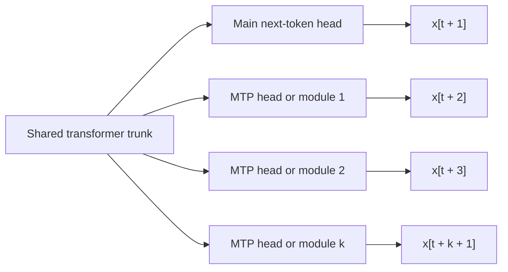
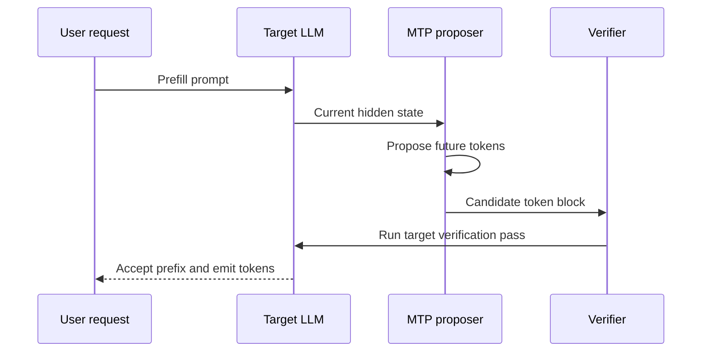

## Multi-Token Prediction

:::info[References]

- [Better & Faster Large Language Models via Multi-token Prediction](https://proceedings.mlr.press/v235/gloeckle24a.html)
- [DeepSeek-V3 Technical Report](https://arxiv.org/abs/2412.19437)
- [Medusa: Simple LLM Inference Acceleration Framework with Multiple Decoding Heads](https://arxiv.org/abs/2401.10774)
- [vLLM / MTP (Multi-Token Prediction)](https://docs.vllm.ai/en/latest/features/speculative_decoding/mtp/)
- [SGLang / DeepSeek V3 / Multi-token Prediction](https://github.com/sgl-project/sglang/blob/main/docs/basic_usage/deepseek_v3.md#multi-token-prediction)
- [Self-Distillation for Multi-Token Prediction](https://arxiv.org/abs/2603.23911)

:::

Multi-Token Prediction (MTP) trains an LLM to predict more than one future token from the same context. Standard next-token prediction optimizes only `x[t + 1]` at position `t`. MTP adds auxiliary prediction targets such as `x[t + 2]`, `x[t + 3]`, and `x[t + 4]`.

The main goals are:

- denser supervision during pre-training;
- better representations for future-token planning;
- native proposal tokens for speculative decoding at inference time.

## Basic Idea


```mermaid
flowchart LR
  A[Shared transformer trunk] --> B[Main next-token head]
  A --> C[MTP head or module 1]
  A --> D[MTP head or module 2]
  A --> E[MTP head or module k]
  B --> F["x[t + 1]"]
  C --> G["x[t + 2]"]
  D --> H["x[t + 3]"]
  E --> I["x[t + k + 1]"]
```

The Gloeckle et al. ICML 2024 design uses `n` independent output heads on top of a shared model trunk. At every corpus position, the model predicts the next `n` tokens. The authors report improved sample efficiency and downstream quality, especially for larger models and code generation, plus up to `3x` faster inference for 4-token prediction under their inference setup.

## DeepSeek-V3 MTP

DeepSeek-V3 adopts MTP as part of its model architecture and training objective. The report describes MTP as both a training-quality technique and an inference-acceleration technique for speculative decoding.

DeepSeek-V3 differs from the independent-head design:

- it predicts additional tokens sequentially rather than only through parallel independent heads;
- it keeps the causal chain for each prediction depth;
- it uses MTP modules that can act as native draft-token producers during decoding.

This means DeepSeek-V3 MTP is closer to a model-integrated speculative proposer than a generic post-hoc serving trick. The MTP weights are part of the model artifact family, and serving frameworks need explicit support for them.

## Inference Path

At inference time, MTP is usually consumed through speculative decoding:


```mermaid
sequenceDiagram
  participant U as User request
  participant T as Target LLM
  participant M as MTP proposer
  participant V as Verifier

  U->>T: Prefill prompt
  T->>M: Current hidden state
  M->>M: Propose future tokens
  M->>V: Candidate token block
  V->>T: Run target verification pass
  T-->>U: Accept prefix and emit tokens
```

The speedup depends on the acceptance rate. If the proposed future tokens match what the target model would have generated, multiple tokens can be accepted from one verification pass. If predictions are rejected often, the extra proposer work can reduce or erase the benefit.

:::tip[Decode work becomes prefill-like verification]

**MTP and speculative decoding can be understood as moving some expensive target-model decoding work into a prefill-like verification pass.** Normal decoding asks the target model to emit one token, append it, and run again. Speculative decoding first lets a cheap proposer guess a block of future tokens, then asks the target model to process the prompt plus that drafted block in one pass. The causal mask still preserves autoregressive correctness, but the target gets logits for several draft positions at once. This is why accepted draft tokens can reduce the number of sequential target decode steps.

:::

## Verification Mechanism

MTP does not make the draft tokens authoritative. The target model remains the verifier. For a prompt such as:

```text
The capital of France is
```

an MTP module or draft model may propose:

```text
Paris. The city
```

The target model receives the prompt plus the drafted tokens and returns logits for each position:

```text
input ids -> embeddings -> transformer -> hidden states -> LM head -> logits
```

The raw target output is a tensor similar to:

```text
[batch_size, sequence_length, vocabulary_size]
```

Each position has a vocabulary-sized logit vector. The serving code compares the draft token ids with the target model's distributions at the matching positions.

The key tensor flow for a normal next-token step is:

```text
token_ids:       [1, 5]
embeddings:      [1, 5, 4096]
hidden states:   [1, 5, 4096]
last hidden:     [4096]
logits:          [50257]
next token id:   scalar
```

For speculative verification with a draft:

```text
draft = " Paris. The city"
```

the target input becomes:

```text
"The capital of France is Paris. The city"
```

Assume the combined input has nine tokens:

```text
input_ids.shape
# [1, 9]
```

After the transformer:

```text
hidden.shape
# [1, 9, 4096]
```

After the LM head:

```text
all_logits.shape
# [1, 9, 50257]
```

The verifier checks several positions:

```text
all_logits[0, 4]  # predicts token after "is"
all_logits[0, 5]  # predicts token after "Paris"
all_logits[0, 6]  # predicts token after "."
all_logits[0, 7]  # predicts token after "The"
```

A simplified greedy result might be:

| Position/context                 | Target top token |
| -------------------------------- | ---------------- |
| after `The capital of France is` | ` Paris`         |
| after `... is Paris`             | `.`              |
| after `... is Paris.`            | ` It`            |
| after `... is Paris. The`        | ` capital`       |

Compared with the draft:

| Source      | Token 1  | Token 2 | Token 3 | Token 4    |
| ----------- | -------- | ------- | ------- | ---------- |
| draft token | ` Paris` | `.`     | ` The`  | ` city`    |
| target top  | ` Paris` | `.`     | ` It`   | ` capital` |
| accept      | yes      | yes     | no      | no         |

That is how one target forward pass returns enough tensors to verify multiple draft tokens.

| Target context                        | Draft token | Target signal                     | Greedy decision |
| ------------------------------------- | ----------- | --------------------------------- | --------------- |
| `The capital of France is`            | `Paris`     | top token is `Paris`              | accept          |
| `The capital of France is Paris`      | `.`         | top token is `.`                  | accept          |
| `The capital of France is Paris.`     | `The`       | top token might be `It`           | reject          |
| `The capital of France is Paris. The` | `city`      | ignored after the previous reject | reject suffix   |

After the first rejection, the remaining drafted suffix is discarded because it was conditioned on tokens that are no longer part of the accepted sequence. Generation then continues from the accepted prefix.

## Causal Mask During Verification

The target can verify several drafted tokens in one forward pass because causal attention prevents future-token leakage. In a sequence such as:

```text
The capital of France is Paris. The city
```

the logit vector after `is` can see only the prompt up through `is`, not `Paris. The city`. The logit vector after `Paris` can see the prompt plus `Paris`, but not later tokens. This lower-triangular attention rule lets a single target pass produce valid next-token distributions for many positions:

```text
after "is"       -> logits for the token after "is"
after "Paris"    -> logits for the token after "Paris"
after "."        -> logits for the token after "."
after "The"      -> logits for the token after "The"
```

The verifier is therefore not asking whether the whole draft is factually reasonable. It is checking whether the draft prefix is compatible with what the target model would have produced under the current decoding algorithm.

## Why It Can Be Faster

Normal autoregressive decoding requires one target-model step per emitted token:

```text
target run -> token 1
target run -> token 2
target run -> token 3
target run -> token 4
```

Speculative decoding with MTP changes the expensive part:

```text
cheap proposer -> draft tokens 1..k
target run     -> verify tokens 1..k in one pass
```

If the target accepts four drafted tokens, the system has emitted four tokens with one expensive verification pass instead of four sequential target decode passes. The verification pass is not free because it processes the draft block, but it can be cheaper than repeated target calls when enough drafted tokens are accepted. The realized speedup is approximately controlled by:

```text
accepted tokens per target verification
- proposer cost
- verification overhead
```

Low acceptance rate removes the benefit because the system pays for draft generation but still emits only a small prefix.

## Greedy And Sampling Acceptance

For greedy decoding, acceptance can be understood as top-1 matching:

```text
accept draft token if draft_token == argmax(target_logits)
```

For sampling, top-1 matching would be wrong because target sampling can legitimately choose non-top-1 tokens. Sampling-based speculative decoding compares the draft distribution `q` with the target distribution `p`. A drafted token `x` is accepted with probability:

```text
min(1, p(x) / q(x))
```

If the target model assigns at least as much probability to `x` as the draft did, the token is accepted. If the draft overestimated `x`, the token is accepted only sometimes. On rejection, the serving algorithm samples from a corrected residual distribution so the final output distribution matches the target model's intended sampling behavior.

## Relation to Speculative Decoding

| Technique                        | Draft source                                | Model changes                               | Typical tradeoff                                                                   |
| -------------------------------- | ------------------------------------------- | ------------------------------------------- | ---------------------------------------------------------------------------------- |
| Draft-model speculative decoding | Separate smaller model                      | No target-model architecture change         | Operationally flexible, but requires serving and maintaining a draft model         |
| Medusa-style heads               | Extra decoding heads                        | Fine-tuned heads, optionally joint training | Avoids a separate draft model, but head quality controls acceptance rate           |
| Native MTP                       | MTP heads or modules trained with the model | Requires model-family support               | Minimal serving configuration when supported, but not portable to arbitrary models |

MTP is best understood as a native way to produce speculative tokens. It does not remove the need for verification when exact sampling behavior matters.

## Serving Support

As of April 30, 2026, serving support is model-family-specific.

vLLM documents MTP as a speculative decoding method for models with native MTP support. It uses `speculative_config` with `"method": "mtp"` and a `num_speculative_tokens` value. The vLLM documentation recommends a small value such as `1` as a starting point and says to use another speculative method when the model family does not support MTP.

```shell
vllm serve XiaomiMiMo/MiMo-7B-Base \
  --tensor-parallel-size 1 \
  --speculative-config '{"method":"mtp","num_speculative_tokens":1}'
```

SGLang documents DeepSeek V3 MTP through EAGLE speculative decoding. Its DeepSeek V3 guide reports speedups of `1.8x` for batch size 1 and `1.5x` for batch size 32 on an H200 TP8 setting.

```shell
python3 -m sglang.launch_server \
  --model-path deepseek-ai/DeepSeek-V3-0324 \
  --speculative-algorithm EAGLE \
  --trust-remote-code \
  --tp 8
```

## Practical Limits

- MTP is not a universal runtime flag. The model must expose compatible MTP weights or modules.
- Throughput gains depend on acceptance rate, batch size, hardware, attention backend, and decoding parameters.
- More speculative tokens are not always better because deeper predictions are usually harder to accept.
- Fine-tuning or quantization can drop, damage, or make MTP weights unsupported unless the tooling preserves them.
- Exact output distribution still depends on the verifier and sampling algorithm, not just the MTP proposer.

## Research Direction

Recent work after the original MTP paper focuses on improving MTP head acceptance rates and reducing training cost. For example, MTP-D proposes self-distillation to improve acceptance while preserving main-head quality, and a looped extension strategy to add more MTP depth economically.

The central open question is not whether multiple-token proposals are useful. The practical question is how to keep the proposal distribution close enough to the target model that the verification step accepts enough tokens to pay for the extra compute.
